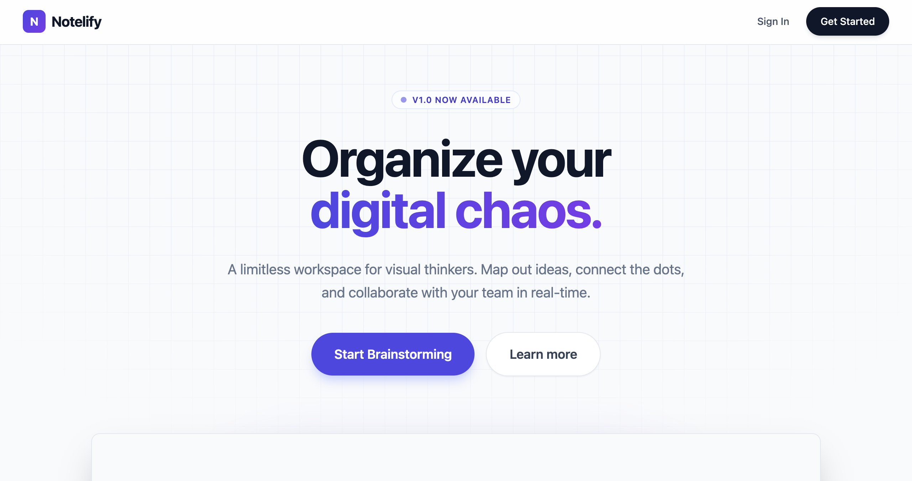

# Digital Notice Board (Notelify)

A modern, real-time collaborative workspace that combines the flexibility of an infinite canvas with the organization of a digital notice board. Built with React, Vite, and Supabase.

## 🚀 Features

### 🎨 Infinite Canvas & Collaboration
- **Infinite Workspace**: Pan and zoom freely across a limitless board.
- **Real-time Presence**: See live cursors of other users on the board.
- **Live Updates**: Changes to notes, positions, and connections sync instantly across all clients.

### 📝 Smart Sticky Notes (Pins)
- **Rich Styling**: Choose from multiple paper textures (Plain, Lined, Grid, Dot) and colors.
- **Categorization**: Tag notes with categories like "Work", "Ideas", "To-Do".
- **Interactivity**: Drag, rotate, and organize notes spatially.
- **Read Receipts**: Track who has read specific notes.

### 🔗 Visual Organization
- **Visual Connections**: Draw lines between notes to create mind maps or flows (Shift + Click).
- **Clusters**: Organize work into separate "Clusters" (Boards).
- **Privacy Controls**: 
  - **Public Clusters**: Discoverable by anyone.
  - **Private/Locked**: Invite-only access.
- **Role-Based Access**: Granular permissions (Admin, Editor, Viewer).

### 💬 Integrated Communication
- **Cluster Chat**: Integrated messaging system for each board.
- **Contextual Discussions**: chat while working on the canvas.

## 🛠 Technology Stack

- **Frontend**: React 19, TypeScript, Vite
- **Styling**: Tailwind CSS, Lucide React (Icons)
- **Animations**: Framer Motion
- **State Management**: Zustand
- **Backend**: Supabase (PostgreSQL)
- **Real-time**: Supabase Realtime (Presence & Broadcast)
- **Auth**: Supabase Auth

## 🏁 Getting Started

### Prerequisites
- Node.js (v18 or higher)
- A Supabase project

### 1. Clone the repository
```bash
git clone https://github.com/UFOASTRO/DigitalNoticeBoard.git
cd notelify
```

### 2. Environment Setup
Create a `.env` file in the project root with your Supabase credentials:

```env
VITE_SUPABASE_URL=your_supabase_project_url
VITE_SUPABASE_ANON_KEY=your_supabase_anon_key
```

### 3. Install Dependencies
```bash
npm install
```

### 4. Run Development Server
```bash
npm run dev
```

## 🗄️ Database Schema

The project uses Supabase (PostgreSQL) with the following core tables:

- **`profiles`**: User data (synced with Auth).
- **`clusters`**: Board metadata (name, description, visibility).
- **`cluster_members`**: Links users to clusters with roles (`admin`, `editor`, `viewer`).
- **`pins`**: The sticky notes. Stores `x`, `y` coordinates, `content` JSON, and styling.
- **`connections`**: Visual lines connecting two pins (`from_pin`, `to_pin`).
- **`messages`**: Chat messages within a cluster.
- **`cluster_invites`**: Temporary invite tokens for joining clusters.

## 📂 Project Structure

```
src/
├── components/         # UI Components
│   ├── dashboard/      # Cluster management UI
│   ├── FloatingDock.tsx # Main canvas controls
│   ├── InfiniteCanvas.tsx # Canvas logic & rendering
│   ├── PaperNote.tsx   # Individual sticky note component
│   └── ...
├── hooks/              # Custom React Hooks
│   ├── usePresence.ts  # Real-time cursor tracking
│   ├── usePins.ts      # Pin CRUD & Sync
│   ├── useCluster.ts   # Cluster logic
│   └── ...
├── lib/                # Utilities (Supabase client)
├── pages/              # Route Pages
│   ├── CanvasPage.tsx  # Main board view
│   ├── DashboardPage.tsx # User dashboard
│   └── ...
├── store/              # Global state (Zustand)
└── types.ts            # TypeScript definitions
```

## 🤝 Contributing

1. Fork the project
2. Create your feature branch (`git checkout -b feature/AmazingFeature`)
3. Commit your changes (`git commit -m 'Add some AmazingFeature'`)
4. Push to the branch (`git push origin feature/AmazingFeature`)
5. Open a Pull Request

## 📄 License

This project is licensed under the MIT License - see the LICENSE file for details.